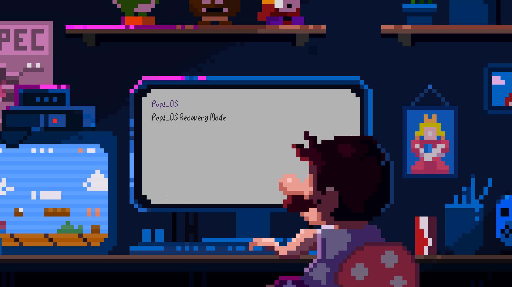

# Preview

# Installation

## Pop!_OS
> sudo apt install grub-efi grub2-common grub-customizer

> sudo grub-install

> sudo cp /boot/grub/x86_64-efi/grub.efi /boot/efi/EFI/pop/grubx64.efi

Now open the grub-customizer and click on _Change Enviroment_ and change the OUTPUT_FILE variable to **/boot/efi/EFI/pop/grub.cfg**

Check the "Save this Configuration" than hit *Apply* and *Save*

## Archlinux
>sudo pacman -S grub

>sudo grub-install --target=x86_64-efi --efi-directory=esp --bootloader-id=GRUB

Stolen from the Archlinux wiki, have no time to try it myself.

## Theme
>git clone https://github.com/Crylia/dotfiles.git

>cd dotfiles/grub/

>sudo cp -r * /boot/grub/

This will copy all the files into your grub directory.

Now open the grub-customizer

* Go to _Appearance settings_
* Theme and select mario
* Hit _Save_ than reboot and enjoy your new bootloader!

### Note / Sources
I got the background image somewhere from google image search and modified it.

The font is from https://www.dafont.com/mario64.font it belongs to Nintendo